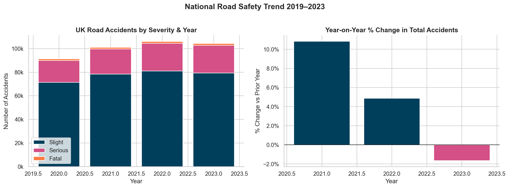
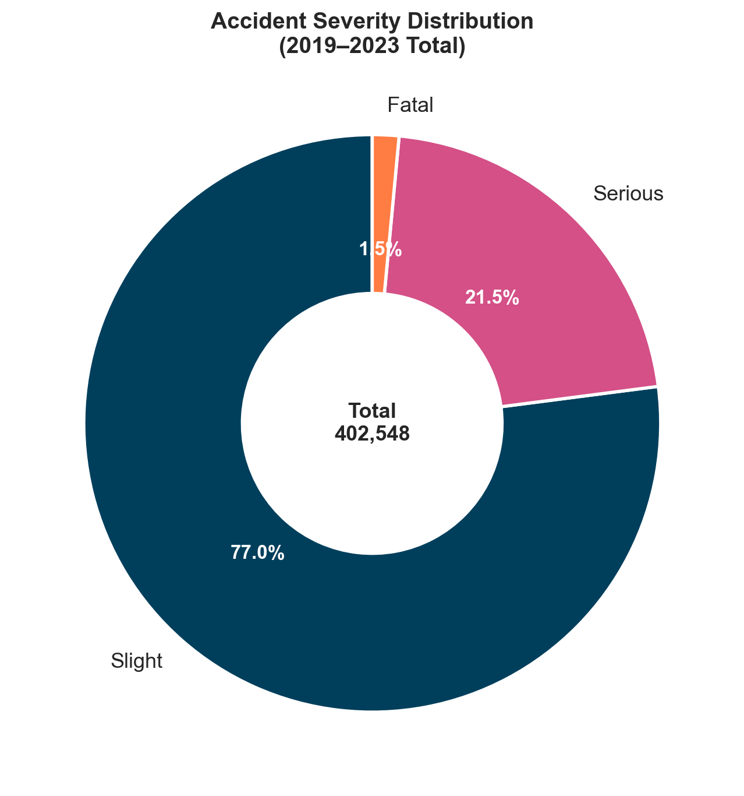
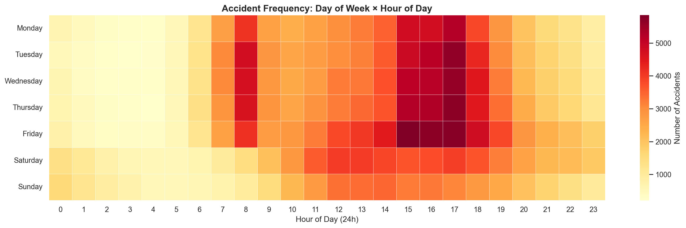
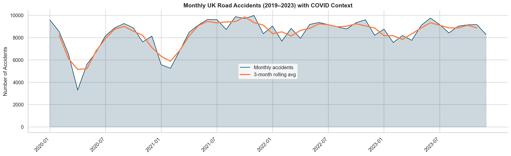
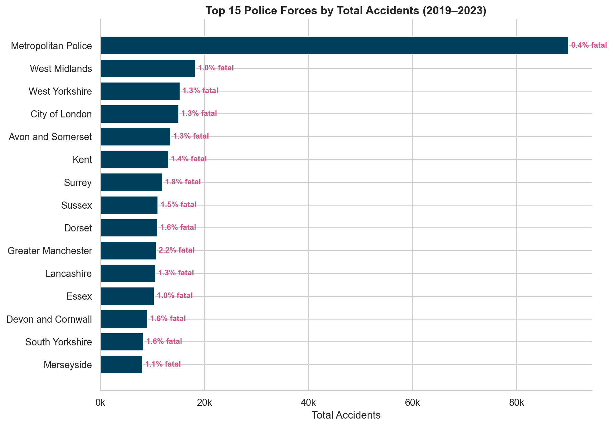
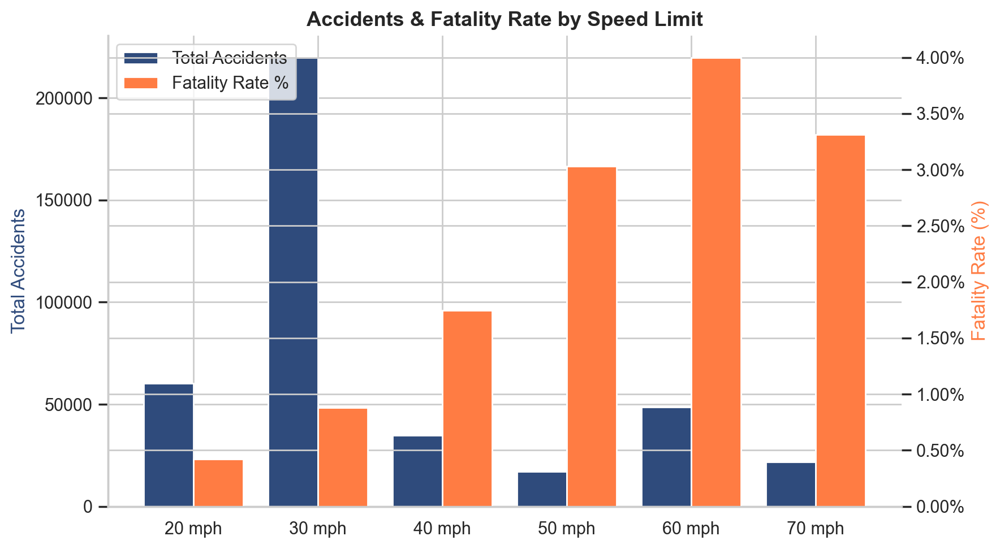
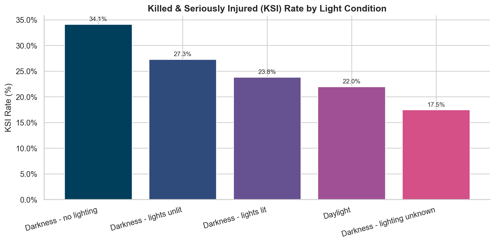
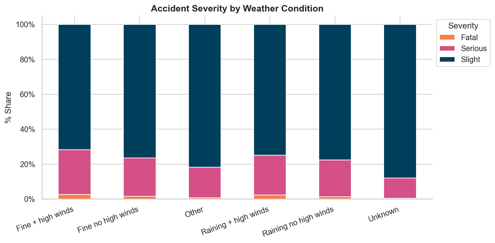
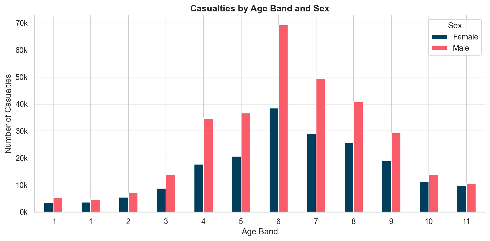
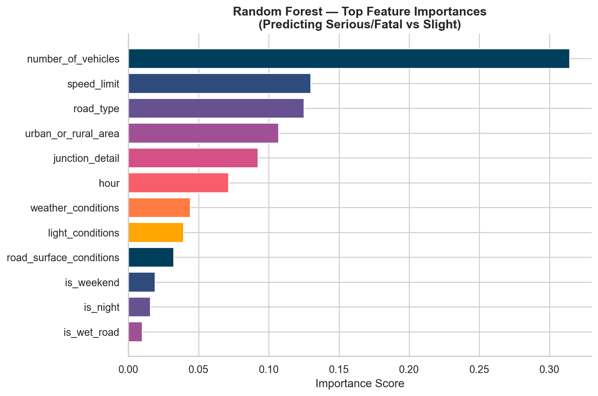

<h1 align="center">🇬🇧 UK Road Safety Intelligence Platform</h1>

<p align="center">
  <strong>End-to-end data analytics portfolio project using real UK Government data</strong><br/>
  <em>Python &nbsp;·&nbsp; SQL &nbsp;·&nbsp; Power BI &nbsp;·&nbsp; Excel &nbsp;·&nbsp; Machine Learning</em>
</p>

<p align="center">
  
  
  
  
  
  
</p>

---

## 📊 Project at a Glance

<table>
<tr>
<td align="center"><strong>402,548</strong><br/>Accidents Analysed</td>
<td align="center"><strong>512,250</strong><br/>Casualties</td>
<td align="center"><strong>737,178</strong><br/>Vehicles</td>
<td align="center"><strong>5,989</strong><br/>Fatal Accidents</td>
<td align="center"><strong>2020–2023</strong><br/>Years Covered</td>
<td align="center"><strong>ROC-AUC 0.637</strong><br/>ML Model Score</td>
</tr>
</table>

> **Data source:** UK Department for Transport — STATS19 (official police-recorded road accidents in Great Britain)
> **Licence:** [Open Government Licence v3.0](https://www.nationalarchives.gov.uk/doc/open-government-licence/version/3/)

---

## 🔍 Key Findings

| # | Finding | Insight |
|---|---------|---------|
| 1 | **Peak accident hour** | 17:00 — Friday PM rush dominates nationally |
| 2 | **Deadliest time** | Overnight 00:00–06:00 — **3.4% fatality rate** vs 1.2% in daylight |
| 3 | **Most dangerous road type** | 60 mph rural roads — **4.0% fatality rate**, 34% KSI rate |
| 4 | **Night + no street lighting** | **5.0% fatality rate** — 4× higher than daylight |
| 5 | **COVID-19 impact** | April 2020: lowest month ever recorded (3,298 accidents, −66%) |
| 6 | **Top ML predictor** | Speed limit is the single strongest predictor of severity |
| 7 | **Statistical significance** | All 8 environmental risk factors significant at p < 0.001 |
| 8 | **Urban vs Rural** | Rural roads: fatal rate 2.9% vs Urban 0.9% — 3× riskier |

---

## 📈 Charts & Visualisations

### National Trends

<table>
<tr>
<td width="60%">

**Annual Accident Volume & Year-on-Year Change**



</td>
<td width="40%">

**Severity Distribution (2020–2023)**



</td>
</tr>
</table>

---

### Time Patterns

**Accident Heatmap — Day of Week × Hour of Day**
*(Red = highest frequency — Friday 17:00 is the clear danger peak)*



**Monthly Trend with COVID-19 Context**
*(The April 2020 lockdown trough is visible as a dramatic dip)*



---

### Geographic & Risk Analysis

<table>
<tr>
<td width="50%">

**Top 15 Police Forces by Accident Volume**
*(% fatal rate shown in pink — rural forces have higher rates despite fewer total accidents)*



</td>
<td width="50%">

**Fatality Rate by Speed Limit**
*(60 mph roads are 4× more fatal than 30 mph roads)*



</td>
</tr>
</table>

<table>
<tr>
<td width="50%">

**KSI Rate by Light Condition**
*(No street lighting = 5% fatality rate)*



</td>
<td width="50%">

**Severity by Weather Condition**
*(Fog and high winds shift the severity mix dramatically)*



</td>
</tr>
</table>

---

### Casualty Demographics & Machine Learning

<table>
<tr>
<td width="50%">

**Casualties by Age Band and Sex**
*(25–40 males are the highest-risk casualty group)*



</td>
<td width="50%">

**Random Forest — Top Feature Importances**
*(Number of vehicles & speed limit are the strongest severity predictors)*



</td>
</tr>
</table>

---

## 🛠️ Tools & What Was Built

<table>
<tr>
<th>Tool</th>
<th>What Was Built</th>
<th>Files</th>
</tr>
<tr>
<td><strong>Python</strong></td>
<td>Full ETL pipeline · EDA · chi-square hypothesis tests · Random Forest ML model · 10 charts</td>
<td><code>python/01–05_*.py</code></td>
</tr>
<tr>
<td><strong>SQL (SQLite)</strong></td>
<td>3-table relational schema · 16 analytical queries (KPIs, trends, regional, risk, advanced) · 7 reusable views</td>
<td><code>sql/01–04_*.sql</code></td>
</tr>
<tr>
<td><strong>Excel</strong></td>
<td>Power Query import · 5 pivot tables · conditional heatmap · KPI dashboard · advanced COUNTIFS/SUMPRODUCT formulas</td>
<td><code>excel/guide.md</code></td>
</tr>
<tr>
<td><strong>Power BI</strong></td>
<td>6-page interactive report · map visuals · drill-through · 15+ DAX measures (YoY, RANKX, DIVIDE) · custom theme</td>
<td><code>power_bi/guide.md</code></td>
</tr>
</table>

---

## 🗂️ Project Structure

```
uk-road-safety-analytics/
├── python/
│   ├── 01_data_download.py          ← Download real data from DfT official URLs
│   ├── 02_data_cleaning.py          ← Clean, decode codes, engineer features
│   ├── 03_eda_analysis.py           ← EDA → 18 summary CSV reports
│   ├── 04_statistical_analysis.py  ← Chi-square tests + Random Forest ML
│   └── 05_visualizations.py        ← 10 charts exported to outputs/charts/
├── sql/
│   ├── 01_schema_create.sql         ← Tables, indexes, police force lookup
│   ├── 02_data_load.sql             ← Load CSVs + integrity checks
│   ├── 03_analysis_queries.sql      ← 16 queries across 6 analytical sections
│   └── 04_views_and_reports.sql     ← 7 views powering Power BI & Excel
├── excel/
│   └── excel_analysis_guide.md      ← Step-by-step Excel dashboard guide
├── power_bi/
│   ├── power_bi_guide.md            ← 6-page dashboard build guide + DAX
│   └── theme.json                   ← Custom branded colour theme
├── outputs/
│   ├── charts/                      ← 10 PNG charts (rendered above)
│   └── reports/                     ← 18 CSV analysis reports
└── data/
    ├── raw/                         ← Populated by 01_data_download.py
    ├── processed/                   ← Populated by 02_data_cleaning.py
    └── exports/                     ← CSVs for Excel & Power BI input
```

---

## ▶️ How to Run

```bash
# Install dependencies
pip install -r python/requirements.txt

# Download ~150 MB of real UK government data
python python/01_data_download.py

# Clean & feature engineer (402K rows → 71 columns)
python python/02_data_cleaning.py

# Run full EDA → outputs 18 CSV reports
python python/03_eda_analysis.py

# Statistical tests + train Random Forest ML model
python python/04_statistical_analysis.py

# Generate all 10 charts
python python/05_visualizations.py
```

Then open **DB Browser for SQLite** → load `data/exports/` → run SQL scripts 01 → 04.

---

## 📋 SQL Queries — Sample

```sql
-- Night + wet road risk matrix (2x2)
SELECT
    CASE WHEN is_night = 1 THEN 'Night' ELSE 'Daylight' END   AS light,
    CASE WHEN is_wet_road = 1 THEN 'Wet Road' ELSE 'Dry Road' END AS surface,
    COUNT(*)                                                    AS accidents,
    ROUND(SUM(is_fatal) * 100.0 / COUNT(*), 2)                 AS fatality_rate_pct
FROM accidents
GROUP BY is_night, is_wet_road
ORDER BY fatality_rate_pct DESC;
```

```sql
-- Year-on-year change by police force (2022 vs 2023)
WITH by_year AS (
    SELECT police_force_label, year, COUNT(*) AS accidents
    FROM accidents WHERE year IN (2022, 2023)
    GROUP BY police_force_label, year
)
SELECT police_force_label,
       SUM(CASE WHEN year=2022 THEN accidents END) AS acc_2022,
       SUM(CASE WHEN year=2023 THEN accidents END) AS acc_2023,
       ROUND((SUM(CASE WHEN year=2023 THEN accidents END) -
              SUM(CASE WHEN year=2022 THEN accidents END)) * 100.0 /
              SUM(CASE WHEN year=2022 THEN accidents END), 1) AS yoy_pct
FROM by_year GROUP BY police_force_label ORDER BY yoy_pct DESC;
```

---

## 📚 Data Source

| Dataset | Source | Licence |
|---------|--------|---------|
| Road Collisions 2020–2023 | [DfT STATS19 — data.gov.uk](https://www.data.gov.uk/dataset/cb7ae6f0-4be6-4935-9277-47e5ce24a11f/road-accidents-safety-data) | OGL v3.0 |
| Casualties 2020–2023 | [DfT STATS19 — data.gov.uk](https://www.data.gov.uk/dataset/cb7ae6f0-4be6-4935-9277-47e5ce24a11f/road-accidents-safety-data) | OGL v3.0 |
| Vehicles 2020–2023 | [DfT STATS19 — data.gov.uk](https://www.data.gov.uk/dataset/cb7ae6f0-4be6-4935-9277-47e5ce24a11f/road-accidents-safety-data) | OGL v3.0 |

---

<p align="center">
  Built by <strong>Muaz Aamir</strong> &nbsp;|&nbsp;
  <a href="mailto:muazaamir97@gmail.com">muazaamir97@gmail.com</a> &nbsp;|&nbsp;
  <a href="https://www.linkedin.com/in/muazaamir97/">LinkedIn</a> &nbsp;|&nbsp;
  UK Data Analytics Portfolio 2025
</p>
